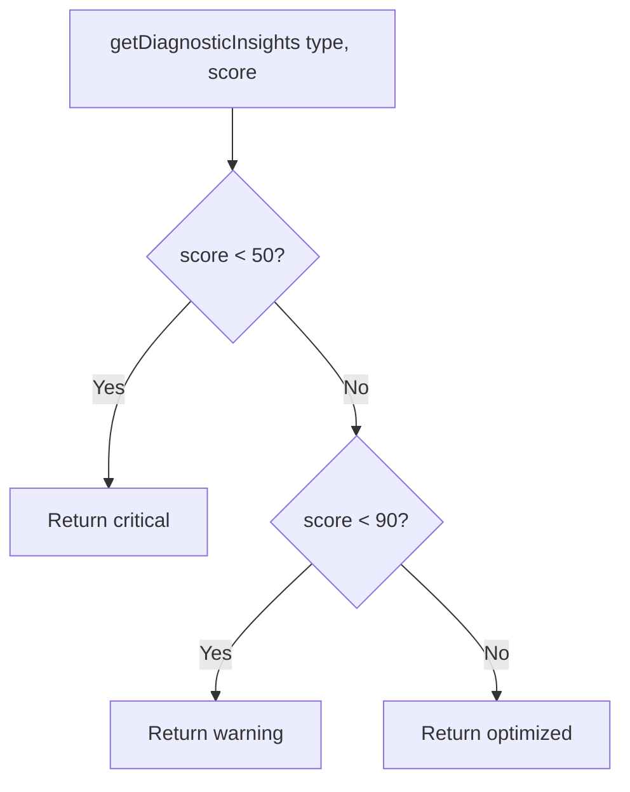

# Design: Diagnostic Mapping

## System Architecture

Pure function module at `src/utils/diagnosticMapping.ts` (104 lines). Exports a single function `getDiagnosticInsights()` that maps a `DiagnosticType` and numeric score to an `InsightLevel` object.

### Logic Flowchart

### Data Structure (4 types × 3 levels = 12 combinations)

Each combination has: `title`, `description`, `action`, `color`.

## Testing Strategy

- Test file: `src/__tests__/utils/diagnosticMapping.spec.ts`
- Environment: Node
- No mocks needed
- Test all 12 type × level combinations + 6 boundary values
