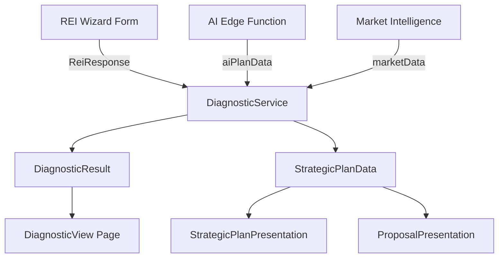

# Design: DiagnosticService — Business Logic Engine

## System Architecture

The `DiagnosticService` is a **pure static class** located at `src/services/DiagnosticService.ts` (1293 lines). It contains zero external dependencies beyond the `ReiResponse` type interface — making it 100% unit-testable without mocks.

### Component Diagram

### Core Methods

| Method | Visibility | Purpose | Test Priority |
|--------|-----------|---------|---------------|
| `generateDiagnosis()` | public static | Main entry — generates full diagnostic from ReiResponse | P0 |
| `generatePlanFromResponse()` | public static | Generates StrategicPlanData for proposals | P0 |
| `generateBenchmarkFromREI()` | public static | Extracts competitor data | P1 |
| `generatePersonasFromREI()` | public static | Generates buyer persona data | P1 |
| `generateDefaultTrends()` | public static | Returns market trends by B2B/B2C | P1 |
| `checkHasCRM()` | private static | CRM detection guard | P0 |
| `checkIsB2B()` | private static | B2B model detection | P0 |
| `ensureArray()` | private static | Safe array coercion | P0 |
| `generateImplementationSteps()` | private static | Go-live task list | P1 |
| `generatePremises()` | private static | Pillars for strategy | P1 |
| `generateMethodology()` | private static | Methodology steps | P1 |
| `generateRoadmap()` | private static | Timeline roadmap | P2 |
| `generateGoals()` | private static | OKRs/Goals | P2 |
| `generateProjections()` | private static | Financial projections | P2 |
| `generateBudget()` | private static | Budget recommendations | P2 |
| `generateNextSteps()` | private static | Next steps list | P2 |

### Data Flow

1. **Input**: `ReiResponse` object containing `responses` (which may have `form_data` wrapper)
2. **Processing**: Rule-based + AI-augmented analysis
3. **Output**: `DiagnosticResult` (signals, risks, decisions, implementation steps) + `StrategicPlanData` (premises, methodology, roadmap, goals, projections, budget, next steps)

### Key Design Decisions

- **Private methods need testing**: Since `checkHasCRM()`, `checkIsB2B()`, and `ensureArray()` are private static, tests must exercise them through the public API (`generateDiagnosis()`) with carefully crafted inputs.
- **AI Override Pattern**: Every generated section checks `aiPlanData?.[field]` first. If present, AI data is used; otherwise, rule-based fallback kicks in.
- **Label Mapping**: `LABEL_MAPS` constant maps raw form IDs to PT-BR labels. The `mapLabel()` and `mapLabels()` functions handle unknown IDs gracefully by returning the raw value.

## Testing Strategy

### Unit Tests (Vitest)
- Test file: `src/__tests__/services/DiagnosticService.spec.ts`
- Environment: Node (no DOM needed)
- Approach: Call static methods with crafted `ReiResponse` objects, assert on output structure and specific field values
- Mock strategy: None needed — pure functions

### Test Data Fixtures
Create fixture objects representing:
1. B2B SaaS company with HubSpot CRM
2. B2C e-commerce without CRM
3. CRM Ops project with custom pipelines and lost reasons
4. Minimal/empty response (edge case)
5. Full AI-enriched response (aiPlanData populated)

### Edge Cases
- `responses.form_data` wrapper vs direct `responses`
- Portuguese accented strings in CRM detection (`não`, `não tenho`)
- Empty arrays/objects in all collection fields
- `crm: 'outro'` with `crm_outro` fallback
