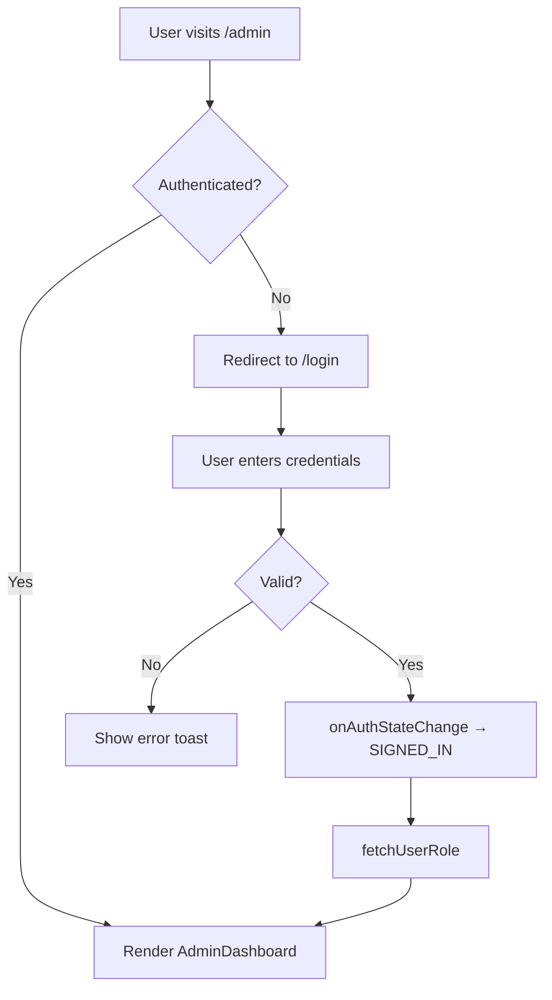

# Design: Authentication Flows — E2E Tests

## System Architecture

Auth flow uses Supabase Auth via `AuthContext.tsx`. The E2E tests validate the **frontend rendering** of auth pages and the **route guard behavior** of `ProtectedRoute`. They do NOT test actual Supabase authentication (that would require test credentials and be flaky).

### Auth Flow Diagram

### Components Under Test

| Component | Path | Behavior |
|-----------|------|----------|
| `Login.tsx` | `/login` | Email + password form |
| `ForgotPassword.tsx` | `/forgot-password` | Email recovery form |
| `Signup.tsx` | `/signup` | Redirects to `/login` |
| `UpdatePassword.tsx` | `/reset-password` | New password form |
| `ProtectedRoute.tsx` | wraps `/admin/*` | Guards against unauthenticated access |
| `AuthContext.tsx` | global provider | Session management |

## Testing Strategy

- Test file: `tests/auth-flows.spec.ts`
- Framework: Playwright
- Approach: Rendering + redirect tests only (no real Supabase calls)
- Protected route tests: Verify redirect occurs within timeout
