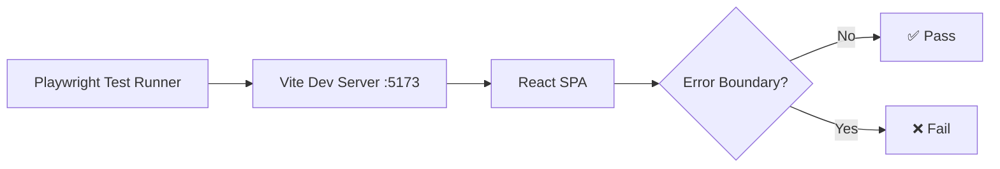

# Design: Public Pages — E2E Smoke Tests

## System Architecture

These are **Playwright E2E tests** that run against the local dev server (`http://localhost:5173`). They validate that critical public-facing pages render without the React Error Boundary firing.

### Test Strategy

### Key Checks Per Page
1. **No Error Boundary**: `text=Algo deu errado` must NOT be visible
2. **Core Element**: At least one identifying element must be visible
3. **No Console Errors**: Critical JS errors should not be present

### Test Configuration
- Config file: `playwright.config.ts` (already exists)
- Test dir: `tests/`
- Dev server should be running during test execution
- Recommended: Add `webServer` config to auto-start dev server

### Browser Matrix
- Chromium (primary)
- Firefox
- WebKit (Safari)

## Implementation Notes

- Use `page.goto()` with `waitUntil: 'networkidle'` for SPA pages
- Use `test.describe()` for grouping by page category
- Use `test.slow()` for heavy pages (SiteScore: 67KB)
- Some pages depend on Supabase data — smoke tests should only verify rendering, not data content
