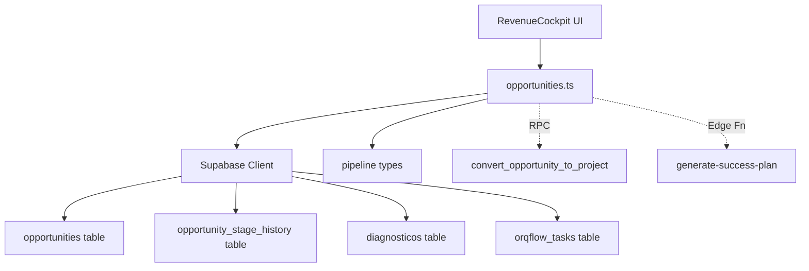

# Design: Opportunities API — Sales Pipeline CRUD

## System Architecture

API module at `src/api/opportunities.ts` (474 lines). Provides the data access layer for the `opportunities` table in Supabase, including CRUD operations, stage advancement, diagnostic linking, project conversion, and funnel metrics.

### Dependencies



### Key Functions

| Function | Supabase Operations | Mock Strategy |
|----------|-------------------|---------------|
| `createOpportunity` | INSERT opportunities + INSERT history | Mock supabase.from().insert().select().single() |
| `getAllOpportunities` | SELECT opportunities WITH diagnosticos | Mock supabase.from().select().order() |
| `advanceOpportunityStage` | SELECT + UPDATE + INSERT history | Mock chain |
| `linkDiagnosticToOpportunity` | SELECT existing + UPDATE or CREATE | Mock with branching |
| `convertOpportunityToProject` | RPC + SELECT + INSERT task + invoke fn | Complex mock |
| `getOpportunityFunnelMetrics` | SELECT all with opportunity_data | Mock with data fixtures |

## Testing Strategy

- Test file: `src/__tests__/api/opportunities.spec.ts`
- Environment: Node
- Mock: Supabase client (vi.mock('@/integrations/supabase/client'))
- Pattern: Each function gets its own describe block with success + error cases
- Fixtures: Opportunity objects matching the database schema

### Mock Pattern
```typescript
vi.mock('@/integrations/supabase/client', () => ({
  supabase: {
    from: vi.fn(() => ({
      insert: vi.fn().mockReturnThis(),
      select: vi.fn().mockReturnThis(),
      update: vi.fn().mockReturnThis(),
      eq: vi.fn().mockReturnThis(),
      single: vi.fn(),
      order: vi.fn(),
      // ...chain methods
    })),
    rpc: vi.fn(),
    functions: { invoke: vi.fn() },
  }
}));
```
