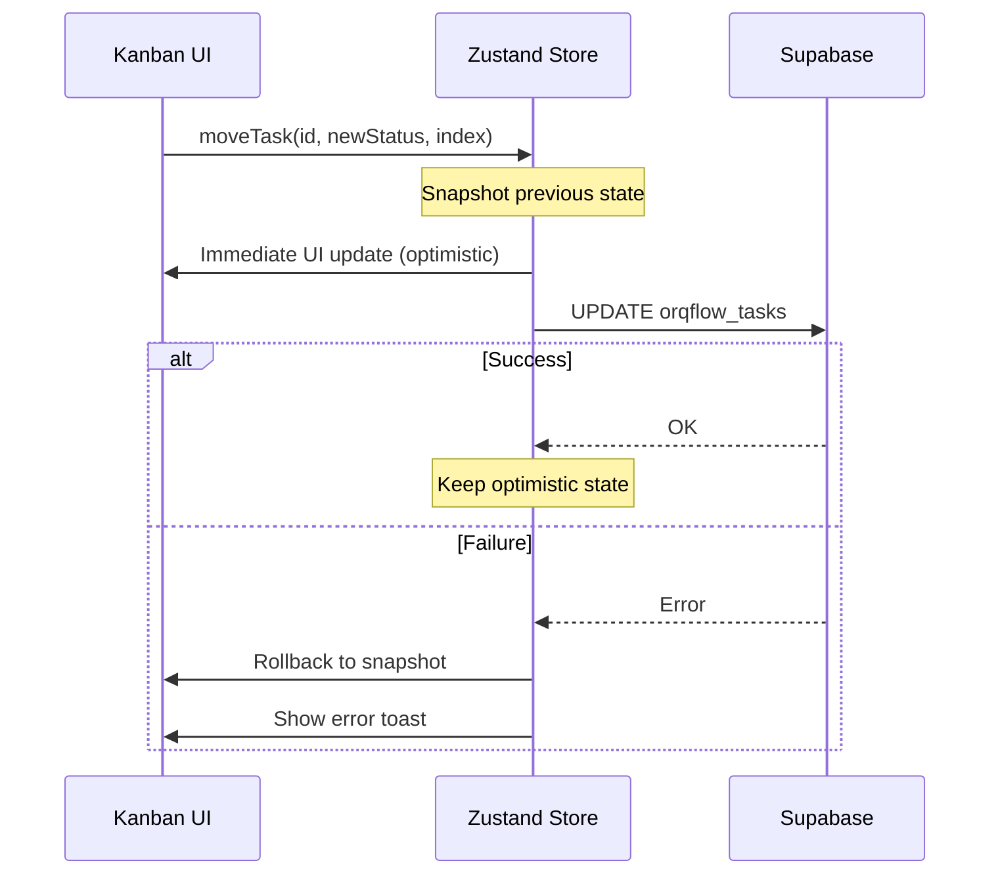

# Design: Orqflow Store — Kanban Task Management (Zustand)

## System Architecture

Zustand store at `src/store/useOrqflow.ts` (416 lines). Manages the entire Kanban board state with normalized data structure, optimistic updates with snapshot rollback, and Supabase realtime subscriptions.

### State Shape

```typescript
interface OrqflowState {
  tasks: Record<string, OrqTask>;                    // O(1) lookup by ID
  kanbanColumns: Record<TaskStatus, string[]>;        // Column → ordered task IDs
  sprints: any[];                                     // Active project sprints
  workspaceUsers: any[];                              // Available team members
  isLoading: boolean;
  activeTimer: { logId: string, taskId: string, startTime: string } | null;
  realtimeChannel: any | null;
}
```

### Optimistic Update Pattern



### Realtime Event Handling

| Event | Action |
|-------|--------|
| INSERT | Add to tasks map + append to column |
| UPDATE (status change) | Remove from old column + add to new column |
| UPDATE (no status change) | Update task in map |
| DELETE | Remove from tasks map + remove from column |

## Testing Strategy

- Test file: `src/__tests__/store/useOrqflow.spec.ts`
- Environment: Node
- Mock: Supabase client
- Pattern: Use `useOrqflowStore.getState()` and `useOrqflowStore.setState()` for direct state manipulation
- Key focus: Optimistic update + rollback correctness, realtime event handling

### Zustand Test Pattern
```typescript
import { useOrqflowStore } from '@/store/useOrqflow';

beforeEach(() => {
  useOrqflowStore.setState({
    tasks: {},
    kanbanColumns: { backlog: [], todo: [], doing: [], review: [], done: [], archived: [] },
    isLoading: false,
    activeTimer: null,
  });
});
```
