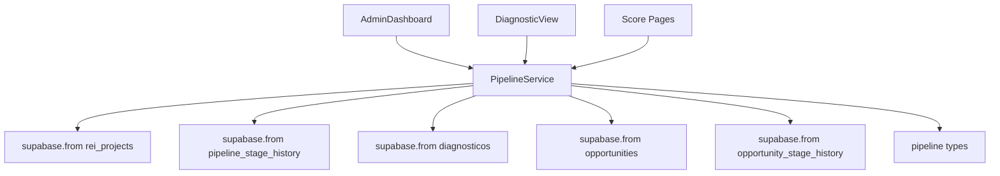

# Design: PipelineService — Project Pipeline Operations

## System Architecture

Service module at `src/services/PipelineService.ts` (351 lines). Manages the **project execution lifecycle** (post-sale), complementing the `opportunities.ts` API which handles the sales lifecycle.

### Dependency Graph



### Function Map

| Function | Reads | Writes | Complexity |
|----------|-------|--------|------------|
| `advanceStage` | rei_projects | rei_projects + history | Medium |
| `getStageHistory` | pipeline_stage_history | — | Low |
| `getProjectsByStage` | rei_projects + clients | — | Low |
| `getFunnelMetrics` | rei_projects | — | Medium |
| `linkDiagnosticToPipeline` | — | diagnosticos + opportunities + history | High |
| `convertDiagnosticoToLead` | rei_projects + rei_responses | rei_projects + history | High |
| `insertStageHistory` | — | pipeline_stage_history | Low |

### Diagnostic Type → Lead Source Mapping

```typescript
const DIAG_TYPE_TO_SOURCE = {
  growth: 'diagnostico_growth',
  revenue: 'diagnostico_revenue', 
  founder: 'diagnostico_founder',
  site: 'diagnostico_site',
};
```

## Testing Strategy

- Test file: `src/__tests__/services/PipelineService.spec.ts`
- Environment: Node
- Mock: Supabase client (`vi.mock`)
- Pattern: Mock the Supabase chain methods, verify correct calls and return values
- Each exported function gets its own `describe` block with success + error scenarios
