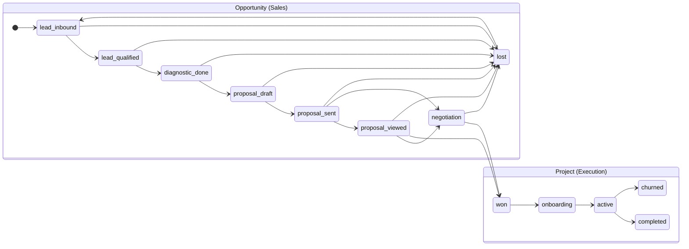

# Design: Pipeline State Machine — Stage Transitions & Type Guards

## System Architecture

The pipeline type system at `src/types/pipeline.ts` (457 lines) defines the complete state machine for the RevHackers commercial lifecycle. It is a **pure type + constant** module with zero runtime dependencies.

### State Machine Diagram

### Module Exports Summary

| Export | Type | Count |
|--------|------|-------|
| `OPPORTUNITY_STAGES` | const array | 9 stages |
| `PROJECT_STAGES` | const array | 4 stages |
| `PIPELINE_STAGES` | const array | 13 (union) |
| `OPPORTUNITY_STAGE_CONFIGS` | Record | 9 configs |
| `PROJECT_STAGE_CONFIGS` | Record | 4 configs |
| `STAGE_CONFIGS` | Record | 13 (merged) |
| `LEAD_SOURCES` | const array | 8 sources |
| `LEAD_SOURCE_LABELS` | Record | 8 labels |
| Validation functions | 5 functions | - |
| Type guards | 2 functions | - |
| Helper functions | 2 functions | - |

## Testing Strategy

### Unit Tests (Vitest)
- Test file: `src/__tests__/types/pipeline.spec.ts`
- Environment: Node
- No mocks needed — pure constants and functions
- Approach: Exhaustive assertion of every valid/invalid transition via matrix

### Transition Matrix Testing
For each OpportunityStage, test every possible `to` stage — assert `isValidOpportunityTransition` returns the expected boolean. This creates a complete truth table guaranteeing no regressions.
