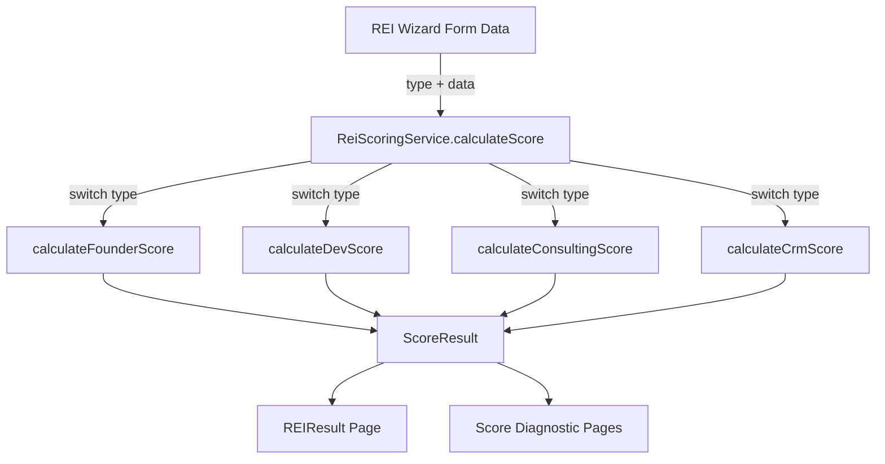

# Design: ReiScoringService — Maturity Score Calculator

## System Architecture

`ReiScoringService` is a pure static class at `src/services/ReiScoringService.ts` (207 lines). It calculates maturity scores across 4 REI types, each producing a score, radar chart data, and textual insights.

### Component Diagram



### Output Interface

```typescript
interface ScoreResult {
    score: number;           // 0-100 averaged total
    radarData: { label: string; value: number }[];  // Always 4 entries
    insights: string[];      // Always 3 entries
}
```

### Scoring Formula Per Type

| Type | Dimensions | Base Values | Min | Max |
|------|-----------|-------------|-----|-----|
| Founder | AUTORIDADE, CONSISTÊNCIA, CRESCIMENTO, UNICIDADE | 50, 50, 50, 60 | 0 | 100 |
| Dev | TECNOLOGIA, DESIGN, ESTRATÉGIA, CONVERSÃO | 60, 60, 60, 50 | 0 | 100 |
| Consulting | PROCESSOS, PESSOAS, DADOS, TECNOLOGIA | 40, 40, 30, 40 | 0 | 100 |
| CRM | ADOÇÃO, PROCESSOS, DADOS, AUTOMAÇÃO | 40, 40, 30, 30 | 10 | 100 |

> **Note**: CRM score has a minimum floor of 10 per dimension (uses `Math.max(10, ...)`).

## Testing Strategy

### Unit Tests (Vitest)
- Test file: `src/__tests__/services/ReiScoringService.spec.ts`
- Environment: Node
- Mock strategy: None needed — pure functions
- Approach: Create data fixtures for each REI type with known modifiers, assert exact score values

### Test Data Fixtures
1. **Founder Max**: Diariamente + Vídeos + Polêmico → high scores
2. **Founder Min**: Empty fields → low scores
3. **Dev High-Ticket**: pronto + completo + High-Ticket → high conversion
4. **Dev Zero Content**: zero + Não temos → low strategy/design
5. **Consulting Enterprise**: 10+ team + many metrics + CRM → high
6. **Consulting Startup**: No CRM + tiny team → low
7. **CRM Optimized**: CRM present + many metrics → high
8. **CRM Broken**: No CRM + meio-processo + dados-cegueira → low
